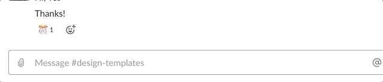

This is a [Reshuffle](https://reshuffle.com/) template.

## A starting point for creating your API with Reshuffle.

This is a Reshuffle template app. Reshuffle provides a progressive way to build fullstack applications, without needing to understand the cloud.

> Note: Reshuffle is built on top of Create React App and Express for the backend

## Screenshots

## Getting Started

1. `npm start` to run a local version of your app.
2. Make changes, and see them reflected locally.
  > Note: Your frontend code resides in the standard `src` directory.
          Backend code needs to reside in the `backend` directory. [Read more here](http://dev.reshuffle.com)
3. `npx reshuffle deploy` to deploy your app to the cloud.

## Available Scripts

In the directory of your Reshuffle project, you can run:

### `npm start`

Runs the app in the development mode. 
Open [http://localhost:3000](http://localhost:3000) to view it in the browser.

The page will reload if you make edits. 
You will also see any lint errors in the console.
You will see any backend errors on the command line

### `npm run build`

Builds the app for production to the `build` folder. 
It correctly bundles React in production mode and optimizes the build for the best performance.

The build is minified and the filenames include the hashes. 
Your app is ready to be deployed!

Read more about deploying with Reshuffle [here](https://dev.reshuffle.com/deploying-to-reshuffle)

### `npx reshuffle deploy`

Deploys your Reshuffle app to the cloud, thereby making it available on your apps URL.

> Note: `reshuffle deploy` implicitly runs `npm run build`

## Learn More

You can learn more about Reshuffle by reading the [dev docs](https://dev.reshuffle.com).

* [API Reference](dev-docs.reshuffle.com)
* [Main Concepts](dev.reshuffle.com/hello-reshuffle)
* [Getting Started](dev.reshuffle.com/getting-started)
* [Running Locally](dev.reshuffle.com/running-locally)

You can learn more about [Create React App by reading the docs.](https://facebook.github.io/create-react-app/docs/getting-started).

To learn React, check out the [React documentation](https://reactjs.org/).

